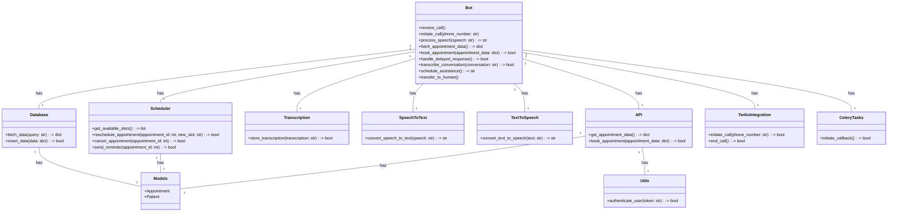
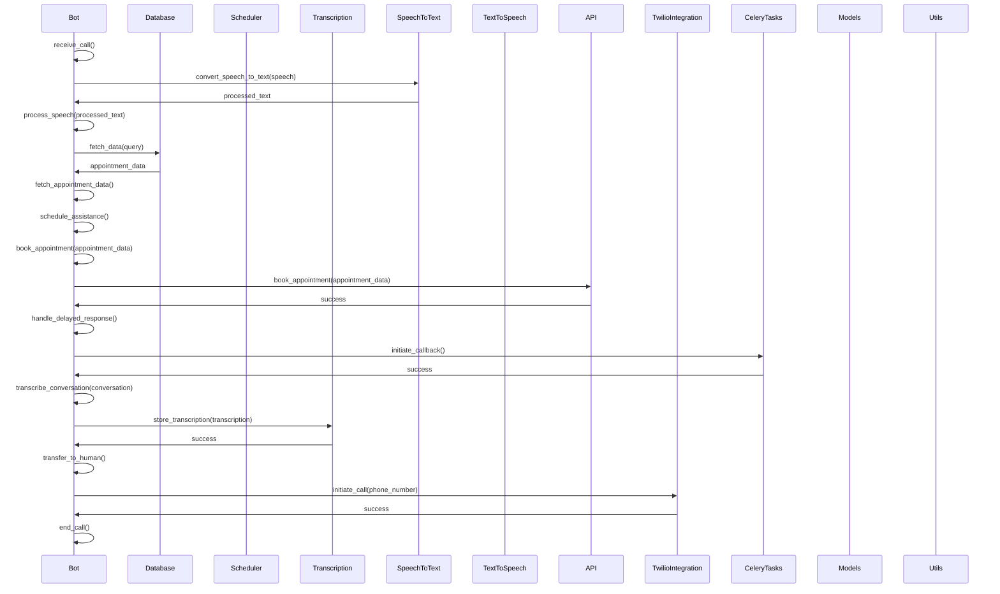

## Implementation approach:

To design an avant-garde customer representative bot tailored for a healthcare scheduling system, we will leverage the following open-source tools:

1. SpeechRecognition: A library for performing speech recognition with support for multiple speech recognition engines. We will use this to convert speech to text for natural language processing.

2. pyttsx3: A Python library for text-to-speech conversion. We will use this to convert text responses into speech for the bot to communicate with patients.

3. Django: A high-level Python web framework that provides a clean and pragmatic design for building web applications. We will use Django to handle the backend logic and database integration for the scheduling system.

4. Django Rest Framework: A powerful and flexible toolkit for building Web APIs. We will use this to create an API for the bot to interact with the scheduling system's database and fetch real-time information.

5. Twilio: A cloud communications platform that provides APIs for voice, video, and messaging. We will use Twilio to handle the initiation and management of phone calls with patients.

6. PostgreSQL: An open-source relational database management system. We will use PostgreSQL to store and retrieve data related to appointments and patient information.

7. Celery: A distributed task queue system. We will use Celery to handle delayed response handling and callback initiation when the bot is unable to provide immediate answers.

8. Redis: An in-memory data structure store. We will use Redis as the message broker for Celery, enabling efficient task management and communication between components.

9. JWT: JSON Web Tokens for authentication and authorization. We will use JWT to secure the API endpoints and ensure only authorized access to patient data.

## Python package name:
```python
"healthcare_bot"
```

## File list:
```python
[
    "main.py",
    "bot.py",
    "database.py",
    "scheduler.py",
    "transcription.py",
    "speech_to_text.py",
    "text_to_speech.py",
    "api.py",
    "twilio_integration.py",
    "celery_tasks.py",
    "models.py",
    "utils.py",
    "settings.py",
]
```

## Data structures and interface definitions:


## Program call flow:


## Anything UNCLEAR:
The requirement is clear to me.